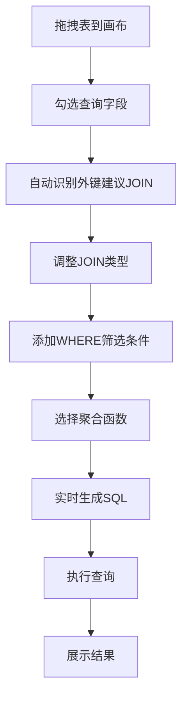

## 1. 产品概述
可视化 SQL 查询构建工具，通过拖拽式界面帮助用户无需编写代码即可构建复杂 SQL 查询，实时预览生成的 SQL 并执行查看结果。
- 主要解决非技术人员难以编写 SQL 的痛点，同时提高开发人员的查询构建效率
- 目标用户为数据分析师、产品经理、开发人员等需要查询数据库的人群
- 产品价值在于降低 SQL 学习门槛，减少手写 SQL 出错率，提升数据查询效率

## 2. 核心功能

### 2.1 用户角色
| 角色 | 注册方式 | 核心权限 |
|------|----------|----------|
| 普通用户 | 无需注册，直接使用 | 构建查询、生成 SQL、执行预览 |

### 2.2 功能模块
1. **主画布页面**：表列表、可视化画布、SQL 面板、结果面板
2. **筛选条件编辑器**：支持字段-操作符-值的可视化 WHERE 条件构建
3. **聚合分组配置**：支持 SUM/AVG/COUNT/MAX/MIN 聚合函数配置

### 2.3 页面详情
| 页面名称 | 模块名称 | 功能描述 |
|-----------|-------------|---------------------|
| 主画布页面 | 表列表 | 展示所有可用表及字段，支持拖拽到画布 |
| 主画布页面 | 可视化画布 | 拖入表节点，勾选字段，通过外键自动建议 JOIN 连线 |
| 主画布页面 | SQL 预览面板 | 实时显示生成的 SQL 文本（只读） |
| 主画布页面 | 结果展示面板 | 执行查询后显示前 100 行结果、列类型、执行耗时 |
| 筛选条件编辑器 | 条件树 | 支持 AND/OR 嵌套的条件树结构 |
| 聚合分组配置 | 聚合函数选择 | 为字段选择聚合函数，自动生成 GROUP BY |

## 3. 核心流程
用户从左侧表列表拖拽表到中央画布 → 勾选需要查询的字段 → 系统自动识别外键并建议 JOIN 连接 → 用户可调整 JOIN 类型（INNER/LEFT/RIGHT/FULL）→ 在筛选条件编辑器中添加 WHERE 条件 → 为数值字段选择聚合函数 → 系统实时生成 SQL → 点击执行按钮查看结果。

## 4. 用户界面设计

### 4.1 设计风格
- **主色调**：深蓝科技风 (#1e3a5f)，搭配青蓝色 (#0ea5e9) 作为强调色
- **辅助色**：深灰 (#1f2937) 背景，浅灰 (#374151) 面板边框
- **按钮风格**：圆角 4px，悬停有轻微上浮效果，主按钮使用青蓝色渐变
- **字体**：使用 JetBrains Mono 作为代码字体，Inter 作为界面字体
- **布局风格**：三栏布局（左侧表列表、中央画布、右侧 SQL+结果面板），卡片式设计
- **图标风格**：使用简洁的线性图标，表、字段、连接等有明确的视觉区分

### 4.2 页面设计概述
| 页面名称 | 模块名称 | UI 元素 |
|-----------|-------------|-------------|
| 主画布页面 | 表列表 | 可折叠的树形结构，表名加粗，字段缩进显示，拖拽时有半透明预览 |
| 主画布页面 | 可视化画布 | 网格背景，表节点为圆角卡片，字段勾选框，JOIN 连线为贝塞尔曲线 |
| 主画布页面 | SQL 面板 | 语法高亮显示，行号，复制按钮 |
| 主画布页面 | 结果面板 | 数据表格，列类型标签，执行耗时显示，分页控件 |
| 筛选条件编辑器 | 条件树 | 嵌套的条件组，可添加/删除条件，AND/OR 切换按钮 |

### 4.3 响应性
- 桌面端优先设计（最小支持 1280px 宽度）
- 三栏布局可拖拽调整宽度
- 画布区域支持缩放和平移

### 4.4 交互细节
- 表节点拖拽：有吸附对齐效果
- 连线交互：悬停时高亮，点击可选择或删除
- 实时反馈：每次操作后 SQL 面板 200ms 内更新
- 执行动画：执行按钮有加载动画，结果表格淡入显示
