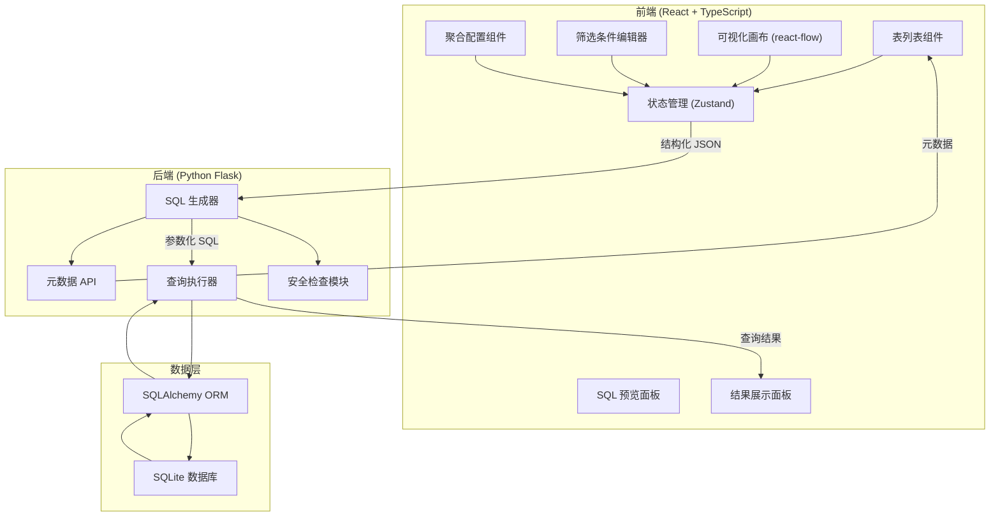
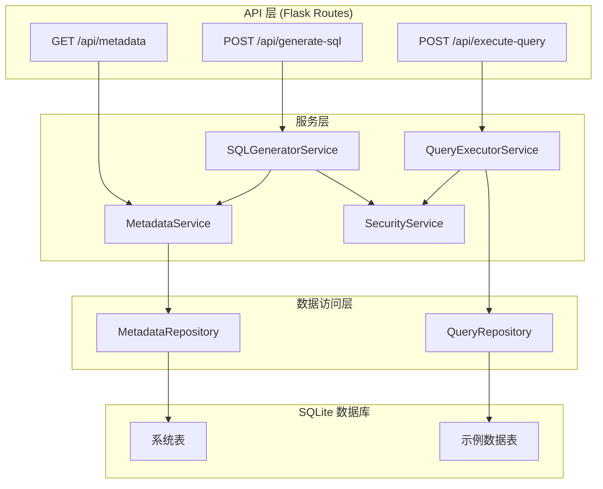
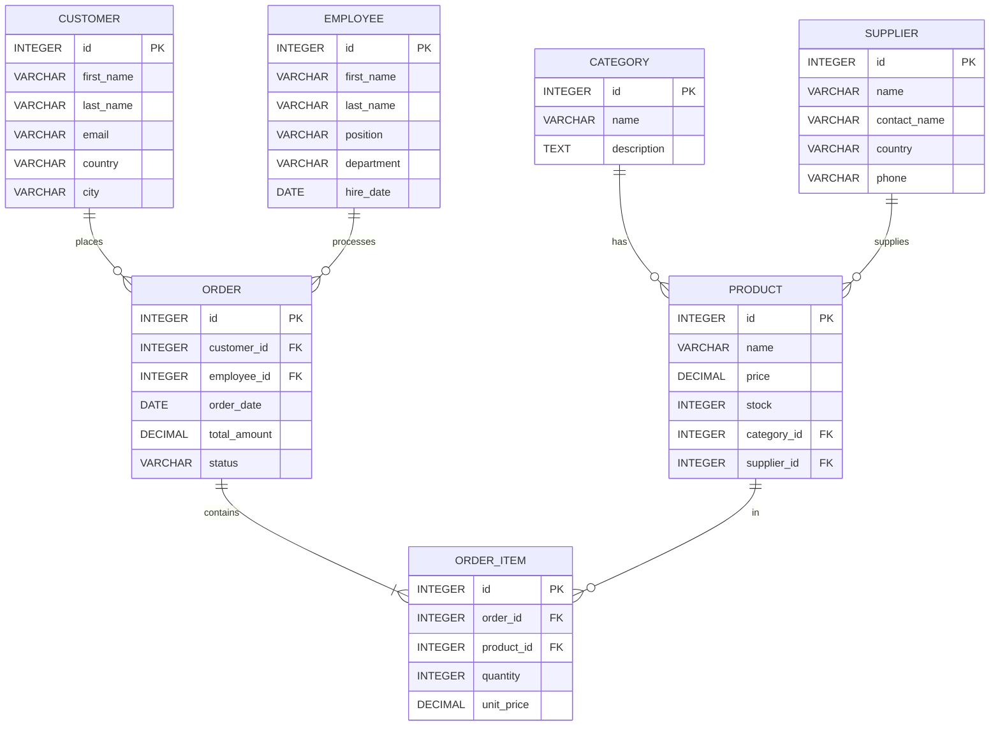

## 1. 架构设计



## 2. 技术描述

- **前端**：React@18 + TypeScript + Vite + TailwindCSS@3 + react-flow@11 + Zustand
- **后端**：Python 3.10 + Flask@3 + SQLAlchemy@2 + SQLite
- **初始化工具**：Vite (前端)、pip (后端)
- **代码规范**：ESLint + Prettier (前端)、flake8 + black (后端)

## 3. 路由定义

| 路由 | 用途 |
|-------|---------|
| / | 主应用页面 |
| /api/metadata | 获取数据库元数据（表、列、外键） |
| /api/generate-sql | 从结构化 JSON 生成 SQL |
| /api/execute-query | 执行参数化查询并返回结果 |

## 4. API 定义

### 4.1 元数据查询
**GET /api/metadata**

响应类型：
```typescript
interface TableMetadata {
  name: string;
  columns: ColumnMetadata[];
  foreignKeys: ForeignKey[];
}

interface ColumnMetadata {
  name: string;
  type: string;
  nullable: boolean;
  isPrimaryKey: boolean;
}

interface ForeignKey {
  constraintName: string;
  fromColumn: string;
  toTable: string;
  toColumn: string;
}
```

### 4.2 SQL 生成
**POST /api/generate-sql**

请求类型：
```typescript
interface QueryStructure {
  tables: TableNode[];
  joins: Join[];
  selectedFields: SelectedField[];
  where: WhereCondition | null;
  aggregations: Aggregation[];
  limit: number;
}

interface TableNode {
  id: string;
  tableName: string;
  alias: string;
  position: { x: number; y: number };
}

interface Join {
  id: string;
  type: 'INNER' | 'LEFT' | 'RIGHT' | 'FULL';
  leftTable: string;
  leftColumn: string;
  rightTable: string;
  rightColumn: string;
}

interface SelectedField {
  tableId: string;
  columnName: string;
  alias?: string;
}

interface WhereCondition {
  op: 'AND' | 'OR';
  children: (WhereCondition | WhereClause)[];
}

interface WhereClause {
  tableId: string;
  columnName: string;
  cmp: '=' | '!=' | '>' | '<' | '>=' | '<=' | 'LIKE' | 'IN';
  value: string | number | boolean | (string | number)[];
}

interface Aggregation {
  tableId: string;
  columnName: string;
  function: 'SUM' | 'AVG' | 'COUNT' | 'MAX' | 'MIN';
  alias?: string;
}
```

响应类型：
```typescript
interface GeneratedSQL {
  sql: string;
  params: Record<string, any>;
}
```

### 4.3 执行查询
**POST /api/execute-query**

请求类型与 SQL 生成相同。

响应类型：
```typescript
interface QueryResult {
  columns: { name: string; type: string }[];
  rows: any[][];
  executionTime: number;
  rowCount: number;
}
```

## 5. 服务器架构图



## 6. 数据模型

### 6.1 数据模型定义



### 6.2 数据定义语言

```sql
-- Category 表
CREATE TABLE category (
    id INTEGER PRIMARY KEY AUTOINCREMENT,
    name VARCHAR(100) NOT NULL,
    description TEXT
);

-- Supplier 表
CREATE TABLE supplier (
    id INTEGER PRIMARY KEY AUTOINCREMENT,
    name VARCHAR(200) NOT NULL,
    contact_name VARCHAR(100),
    country VARCHAR(100),
    phone VARCHAR(50)
);

-- Product 表
CREATE TABLE product (
    id INTEGER PRIMARY KEY AUTOINCREMENT,
    name VARCHAR(200) NOT NULL,
    price DECIMAL(10, 2) NOT NULL,
    stock INTEGER DEFAULT 0,
    category_id INTEGER,
    supplier_id INTEGER,
    FOREIGN KEY (category_id) REFERENCES category(id),
    FOREIGN KEY (supplier_id) REFERENCES supplier(id)
);

-- Customer 表
CREATE TABLE customer (
    id INTEGER PRIMARY KEY AUTOINCREMENT,
    first_name VARCHAR(50) NOT NULL,
    last_name VARCHAR(50) NOT NULL,
    email VARCHAR(200) UNIQUE,
    country VARCHAR(100),
    city VARCHAR(100)
);

-- Employee 表
CREATE TABLE employee (
    id INTEGER PRIMARY KEY AUTOINCREMENT,
    first_name VARCHAR(50) NOT NULL,
    last_name VARCHAR(50) NOT NULL,
    position VARCHAR(100),
    department VARCHAR(100),
    hire_date DATE
);

-- Order 表
CREATE TABLE "order" (
    id INTEGER PRIMARY KEY AUTOINCREMENT,
    customer_id INTEGER NOT NULL,
    employee_id INTEGER,
    order_date DATE NOT NULL,
    total_amount DECIMAL(12, 2) DEFAULT 0,
    status VARCHAR(50) DEFAULT 'pending',
    FOREIGN KEY (customer_id) REFERENCES customer(id),
    FOREIGN KEY (employee_id) REFERENCES employee(id)
);

-- Order Item 表
CREATE TABLE order_item (
    id INTEGER PRIMARY KEY AUTOINCREMENT,
    order_id INTEGER NOT NULL,
    product_id INTEGER NOT NULL,
    quantity INTEGER NOT NULL,
    unit_price DECIMAL(10, 2) NOT NULL,
    FOREIGN KEY (order_id) REFERENCES "order"(id),
    FOREIGN KEY (product_id) REFERENCES product(id)
);

-- 索引
CREATE INDEX idx_product_category ON product(category_id);
CREATE INDEX idx_product_supplier ON product(supplier_id);
CREATE INDEX idx_order_customer ON "order"(customer_id);
CREATE INDEX idx_order_employee ON "order"(employee_id);
CREATE INDEX idx_order_date ON "order"(order_date);
CREATE INDEX idx_order_item_order ON order_item(order_id);
CREATE INDEX idx_order_item_product ON order_item(product_id);
```
